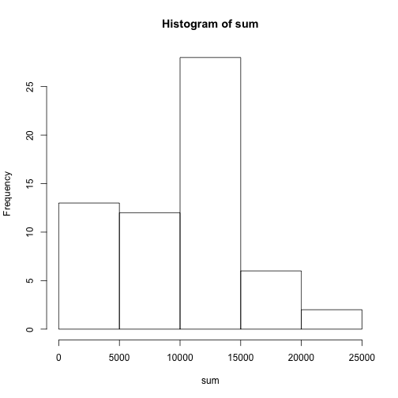
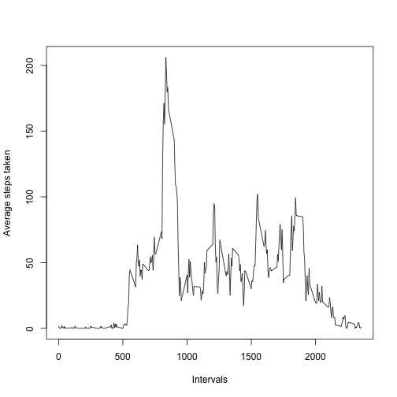
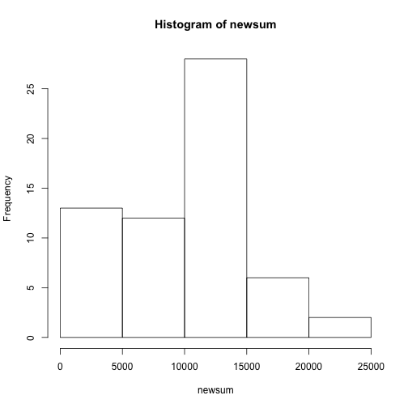
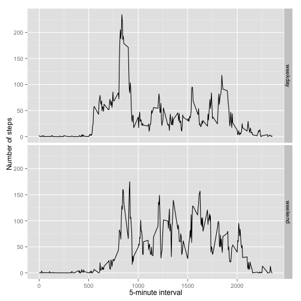

##Section 1

Let's first read the data. 


```r
steps<-read.csv('activity.csv')
```

##Section 2

After calculating the total number of steps taken per day, here's a histogram of those values:


```r
sum<-tapply(steps$steps, steps$date, sum, na.rm=TRUE)
hist(sum)
```

 

We now need to calculate the mean and median of the total number of steps taken per day. 


```r
mean<-mean(sum)
median<-median(sum)
```

The mean of the total number of steps taken per day is 9354.2295082 and the median is 10395. 

##Section 3

Here's a time series plot of the 5-minute interval and the average number of steps taken, averaged across all days: 


```r
timeseries<-tapply(steps$steps, steps$interval, mean, na.rm=TRUE)
df<-data.frame(matrix(unlist(timeseries), nrow=length(timeseries), byrow=T))
names(df)<-c('average')
df$interval<-names(timeseries)
plot(names(timeseries), df$average, type='l', xlab='Intervals', ylab='Average steps taken')
```

 

```r
max<-df$interval[[which.max(df$average)]]
```

Also, the 5-minute interval that contains the maximum number of steps (on average accross all the days in the dataset) is the interval 835. 

##Section 4

Now we need to calculate the number of rows with missing values in the dataset. 


```r
nas<-sum(is.na(steps$steps))
```

The total number of rows with missing values is 2304. 

We now need to fill in all the missing values in the dataset. For each missing value, I fill in using the average number of steps taken for each respective interval. I then create a new dataset using these new values. 


```r
df$interval<-as.integer(df$interval)
for(n in 1:nrow(steps)){
     if(is.na(steps$steps[n]>1)){
          index<-match(steps$interval[n], df$interval)
          steps$steps[n]<-''
          steps$steps[n]<-df$average[index]
     }
}
newsteps<-read.csv('activity.csv')
```

Here's the new histogram of the total number of steps taken per day: 


```r
newsum<-tapply(newsteps$steps, newsteps$date, sum, na.rm=TRUE)
hist(newsum)
```

 

I now calculate the new mean and median of the total number of steps taken. 


```r
newmean<-mean(newsum)
newmedian<-median(newsum)
```

Now, the mean of the total number of steps taken per day is 9354.2295082 and the median is 10395. Filling in the data with this method does not alter the value of the mean and median. 

##Section 5

I now create a new factor variable using the new dataset with two levels - "weekday" and "weekend". 


```r
newsteps$date<-strptime(as.character(newsteps$date), '%F')
newsteps$day<-weekdays(newsteps$date)
newsteps$weekday_division<-''
weekdays<-c('Monday', 'Tuesday', 'Wednesday', 'Thursday', 'Friday')
for(n in 1:nrow(newsteps)){
     if(newsteps$day[n] %in% weekdays==1){
          newsteps$weekday_division[n]<-'weekday'
     } else{
          newsteps$weekday_division[n]<-'weekend'
     }
}
```

And, finally, I create a panel plot containing a time series plot of the 5-minute interval and the average number of steps taken, averaged across all weekday days or weekend days. 


```r
library(stats)
library(ggplot2)
finalaverage<-aggregate(steps ~ interval + weekday_division, data=newsteps, FUN='mean')
ggplot(finalaverage, aes(interval, steps))+geom_line()+facet_grid(weekday_division~.)+xlab('5-minute interval')+ylab('Number of steps')
```

 
